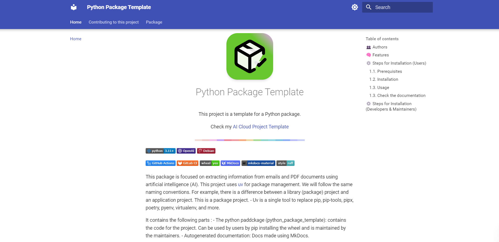

<div style="text-align: center;">

  

  <h1>Python Package Template</h1>

  <p>This project is a template for a Python package.</p>
  <p>Check my <a href="http://">AI Cloud Project Template</a></p>

  

</div>

[](https://www.python.org/downloads/release/python-3110/)
[](https://learn.microsoft.com/en-us/azure/ai-services/openai/)
[](https://www.debian.org/)

[](https://github.com/features/actions)
[](https://docs.gitlab.com/ee/ci/)
[](dist)
[](https://www.mkdocs.org/)
[]()
[](https://github.com/charliermarsh/ruff)


This package is focused on extracting information from emails and PDF documents using artificial intelligence (AI).
This project uses [uv](https://docs.astral.sh/uv) for package management. We will follow the same naming conventions. For example, there is a difference between a library (package) project and an application project. This is a package project.

- Uv is a single tool to replace pip, pip-tools, pipx, poetry, pyenv, virtualenv, and more.


It contains the following parts :

- **The Python package (python_package_template)**: contains the code for the project. It can be used by users by pip installing the wheel and is maintained by the maintainers.

- **Autogenerated documentation**: Docs made using MkDocs.


<div style="text-align: center;">
    
</div>

## 👥  Authors
- (Author) Amine Djeghri

## 🧠 Features

**Engineering:**
- [x] Use UV to manage packages

- [x] pre-commit hooks: use ``ruff`` to ensure the code quality & ``detect-secrets`` to scan the secrets in the code.

- [x] Logging using loguru


**CI/CD & Maintenance tools:**
- [x] CI/CD pipelines with GitHub and GitLab (cache is not yet enabled in GitHub Actions)

- [x] Local GitHub Actions using ``github act`` and local GitLab CI/CD using ``gitlab-ci-local``

- [x] Docker, Gitlab CI and Github Actions all use the same make install command.
  There is no need to handle them separately.
- [ ] Deploy the documentation using mkdocs gh-deploy
- [ ] Deploy the wheel in packages github

**Documentation:**
- [x] Wiki creation and setup of documentation website using Mkdocs

- [x] GitHub Pages deployment using mkdocs gh-deploy plugin


## ⚙️ Steps for Installation (Users)
### 1.1. Prerequisites
- Ubuntu 22.04
- Python 3.11

### 1.2. Installation
use pip or uv pip to install the package :
```bash
pip install dist/my-package-0.1.0-py3-none-any.whl
# or
uv pip install dist/my-package-0.1.0-py3-none-any.whl
```

### 1.3. Usage

````python

````

### 1.3. Check the documentation

You can check the documentation, the ``notebooks`` and the examples in the docs folder.

## ⚙️ Steps for Installation (Developers & Maintainers)

- Check the [CONTRIBUTING.md](CONTRIBUTING.md) file for installation instructions
